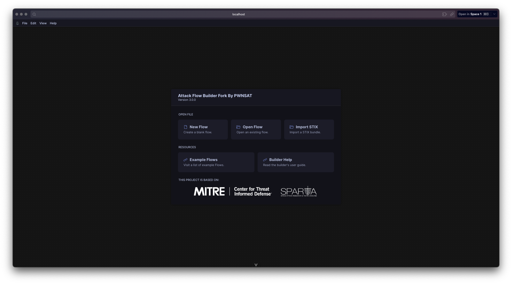
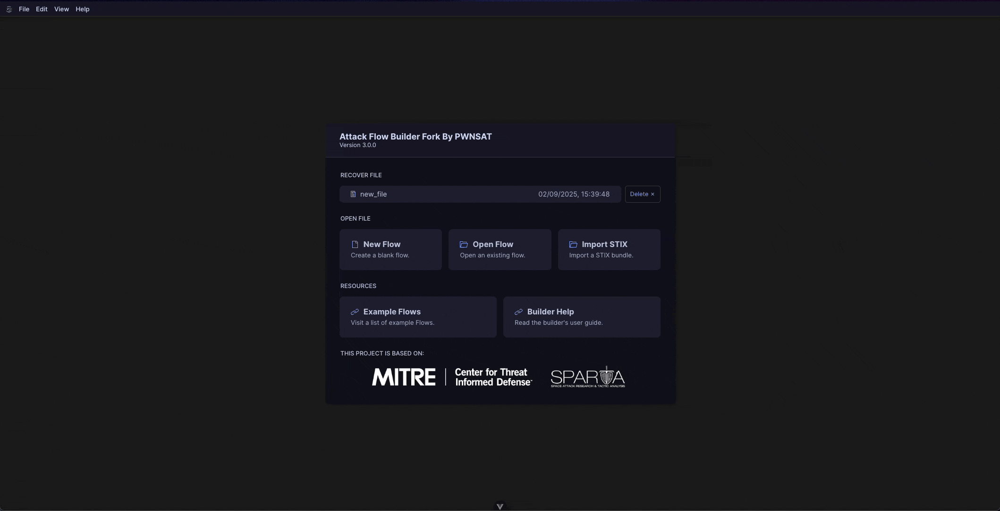

## Introduction
One of the most powerful aspects of cybersecurity research is the ability to extend and adapt existing tools to cover new domains. While the **[Attack Flow Builder](https://github.com/center-for-threat-informed-defense/attack-flow)** from MITRE was originally designed to visualize and model cyber operations based on the **MITRE ATT&CK framework**, I needed to go a step further for my research in **space cybersecurity**.

The challenge: how to integrate **[SPARTA](https://sparta.aerospace.org/)** (a cybersecurity framework for space systems) into the Attack Flow Builder so that we can model attacks not only in traditional IT/OT contexts, but also in the space domain.

This post documents the process of extending Attack Flow Builder, the technical details of the integration, and the results of enabling **hybrid attack flows** that combine MITRE ATT&CK with SPARTA.

> If you want to test this fork check the [repo.](https://github.com/JahazielLem/attack-flow)



## Technical Approach
### 1. Understanding the data model

Attack Flow Builder consumes **Structured Threat Information Expression (STIX™)**, which define tactics, techniques, and relationships from MITRE ATT&CK. To integrate SPARTA, I needed to generate an equivalent dataset that followed the same schema while preserving SPARTA’s unique identifiers (e.g., `REC-0001`, `EX-0002`).

SPARTA already provides a `STIX` dataset with its TTPs, but this is not directly compatible with Attack Flow Builder. Some identifiers and relationships had to be restructured in order to be usable.

### 2. Mapping identifiers

MITRE ATT&CK uses identifiers such as `TA0001` or `T1003`. SPARTA, however, defines techniques with a `PREFIX-NUMBER` pattern (e.g., `EX-0001`).

Since MITRE ATT&CK works with **Tactics** and **Techniques**, I modified the parsing logic in Attack Flow Builder to also support **sub-techniques** for SPARTA.
#### Accept Tactics
The original regex filtered only `TA` tactics:
```js 
return tactText.split(/TA\d+/)[1].trim();
```

I modified it to accept SPARTA as well:
```js 
return tactText.split(/(TA|ST)\d+/)[1].trim();****
```

Although this is a non-generic solution, it works for the purposes of this integration.
#### Accept Techniques
Techniques were originally filtered with:
```js 
return techText.split(/T\d+(?:\.\d+)?/)[1].trim();
```

I replaced it with a more generic regex that works for both MITRE and SPARTA identifiers:
```js 
return techText.split(/(T|[A-Z]+-?)\d+(?:\.\d+)?/)[1].trim();
```

This regex expression it's more generic than the *tactics* implementation.
### 3. Modifying the builder logic
Several adjustments were necessary in Attack Flow Builder’s parsing and rendering pipeline:
- Recognize SPARTA identifiers as **techniques**.
- Add support for **sub-techniques**.
- Update the visualization layer so SPARTA nodes render seamlessly within flows.

#### Adding the sub-techniques
Attack Flow Builder uses `attack-pattern` for techniques. SPARTA, however, required additional logic to support sub-techniques. I extended the mapping inside `STIX_TO_ATTACK` as follows:
```js 
/**
* A map that relates STIX types to ATT&CK types.
*/
const STIX_TO_ATTACK = {
	// ... Others STIX relations
	"x-mitre-tactic": "tactic",
	"attack-pattern": "technique",
	"attack-subpattern": "subtechnique"
}
```

In this case I mapped the `attack-supattern` with the `subtechnique` relationship. In Attack Flow Builder use the `attack-pattern` for refer to *techniques* and by the *STIX* file for SPARTA use this *attack-pattern* identifier by all the TTP's so this was the first bigger modification that I need to consider.

Then, I need to add the logic to the `update_mitre_attack.mjs`, this files is used by the command `npm run update-attack` to download the latest release of each attack supported, and export the mapped data to the `MitreAttacks.ts` which it's the "db" for attacks.

To allow the support for sub-techniques and mapping this, I add the next code to the `update_mitre_attack`, first SPARTA their *techniques* can have their sub-techniques, but since not all have their sub-items, I add a validation, if the the techniques have sub-techniques then the complete tree , otherwise use  technique with the tactic.

```typescript
async function updateApplicationAttackEnums(path, ...urls) {
	// ... Rest of the code
	for(const tact of types.get("tactic")) {
		if(tact.deprecated) {
			continue;
		}
		// Format matrix
		const matrix = tact.domains.map(
			o => o.substring(0,3).toLocaleUpperCase()
		).join(", ");
		// Format tactic
		tactics.push([
			tact.id, `[${matrix}] ${tact.id} ${tact.name}`
		]);
		for(const tech of tact.techniques) {
			if (tech.subtechniques != undefined){
				for(const subtech of tech.subtechniques){
					relationships.push(["tactic", tact.id, "technique", tech.id, "subtechnique", subtech.id]);
				}
			}else{
				relationships.push(["tactic", tact.id, "technique", tech.id]);
			}
		}
		stixIds[tact.id] = tact.stixId;
	}
	tactics.sort(([a],[b]) => a.localeCompare(b));
	// Organize subtechniques
	const subtechniques = [];
	for(const tech of types.get("subtechnique")) {
		if(tech.deprecated) {
			continue;
		}
		const matrix = tech.domains.map(
			o => o.substring(0,3).toLocaleUpperCase()
		).join(", ");
		subtechniques.push([tech.id, `[${matrix}] ${tech.id} ${tech.name}`]);
		stixIds[tech.id] = tech.stixId;
	}
	
	subtechniques.sort(([a],[b]) => a.localeCompare(b));
	// Generate enums file

	let file = "";
	file += `export const ${ EXPORT_KEY } = `;
	file += JSON.stringify({ tactics, techniques, subtechniques, relationships, stixIds });
	file += `;\n\nexport default ${ EXPORT_KEY };\n`
	writeFileSync(path, file);
	// Done
	console.log("\nMITRE ATT&CK enumerations updated successfully.\n");
}
```
### 4. Results

With these changes (and several minor adjustments), Attack Flow Builder now supports **hybrid attack flows**.

A researcher can, for example, model an intrusion scenario where initial access is described with ATT&CK (`T1078 – Valid Accounts`) and lateral movement is described using SPARTA (`LM-0007 – Credentialed Traversal`).

This cross-domain visibility is crucial for analyzing cyber threats to **space-ground systems**, where enterprise IT attacks intersect with satellite-specific vulnerabilities.



## Why This Matters
The integration highlights two key insights:
1. **Extensibility of MITRE tools** – with minor modifications, existing frameworks can be adapted to entirely new domains.
2. **Bridging IT and Space Cybersecurity** – researchers now have a way to represent and analyze threats that cross from enterprise IT systems into spacecraft operations.

This work is not about replacing ATT&CK or SPARTA, but about **making them interoperable** in a way that improves threat modeling and visualization for the community.


## About Attack Flow
This work is a fork of the **[Attack Flow Builder](https://github.com/center-for-threat-informed-defense/attack-flow?utm_source=chatgpt.com)**, originally created and maintained by the [MITRE Center for Threat-Informed Defense](https://ctid.mitre.org/?utm_source=chatgpt.com) to advance the state of the art in threat-informed defense.

According to the official repository:

> “This project is created and maintained by the MITRE Center for Threat-Informed Defense in furtherance of our mission to advance the state of the art and the state of the practice in threat-informed defense globally. The project is funded by our research participants.”

This fork is **maintained independently by the PWNSAT team** and is **not affiliated with MITRE or the Center for Threat-Informed Defense**.

## Disclaimer

This project is an independent fork of MITRE’s Attack Flow Builder. It is maintained by the PWNSAT team for research and educational purposes.

- MITRE, the MITRE ATT&CK framework, and Attack Flow Builder are trademarks or registered projects of The MITRE Corporation.
- SPARTA is an independent initiative maintained by the Aerospace Corporation.
- This fork and the modifications described here are **not endorsed, sponsored, or supported by MITRE, the Center for Threat-Informed Defense, or the Aerospace Corporation**.

Use of this project should comply with the terms of the **Apache 2.0 License** under which Attack Flow Builder was originally released. Any responsibility for modifications, integration errors, or derived results lies solely with the maintainers of this fork.